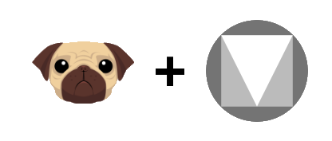

# pug-mdc

<center>



[](http://makeapullrequest.com) [](https://snyk.io/test/github/henriquehbr/pug-mdc)

</center>

> A collection of pug mixins to make the work with Material Web Components way easier

## Installation

```bash
yarn add pug-mdc
```

or

```bash
npm i pug-mdc
```

## Usage

Basically, a pug mdc mixin is composed of a mixin with the MDC component name, and it's parameters

```pug
//- Creates a raised mdc button with a heart icon
+mdc-button-raised({ label: "Raised Button", icon: "favorite" })

//- Creates a "body 2" sized "Hello World!" paragraph
+mdc-typography-body2("Hello World!")
```

## Roadmap (48% done)

- [x] Auto init
- [x] Button
- [x] Card
- [x] Checkbox
- [x] Chip
- [x] Chipset
- [x] Dialog
- [x] Drawer
- [x] Floating action button
- [ ] Grid
- [x] Icon button
- [x] Image list
- [ ] Linear Progress
- [ ] List
- [ ] Menu
- [ ] Radio
- [ ] Select
- [ ] Slider
- [ ] Snackbar
- [ ] Switch
- [ ] Tabs
- [ ] Text field
- [ ] Top app bar
- [x] Typography
- [ ] Data table _(coming soon)_